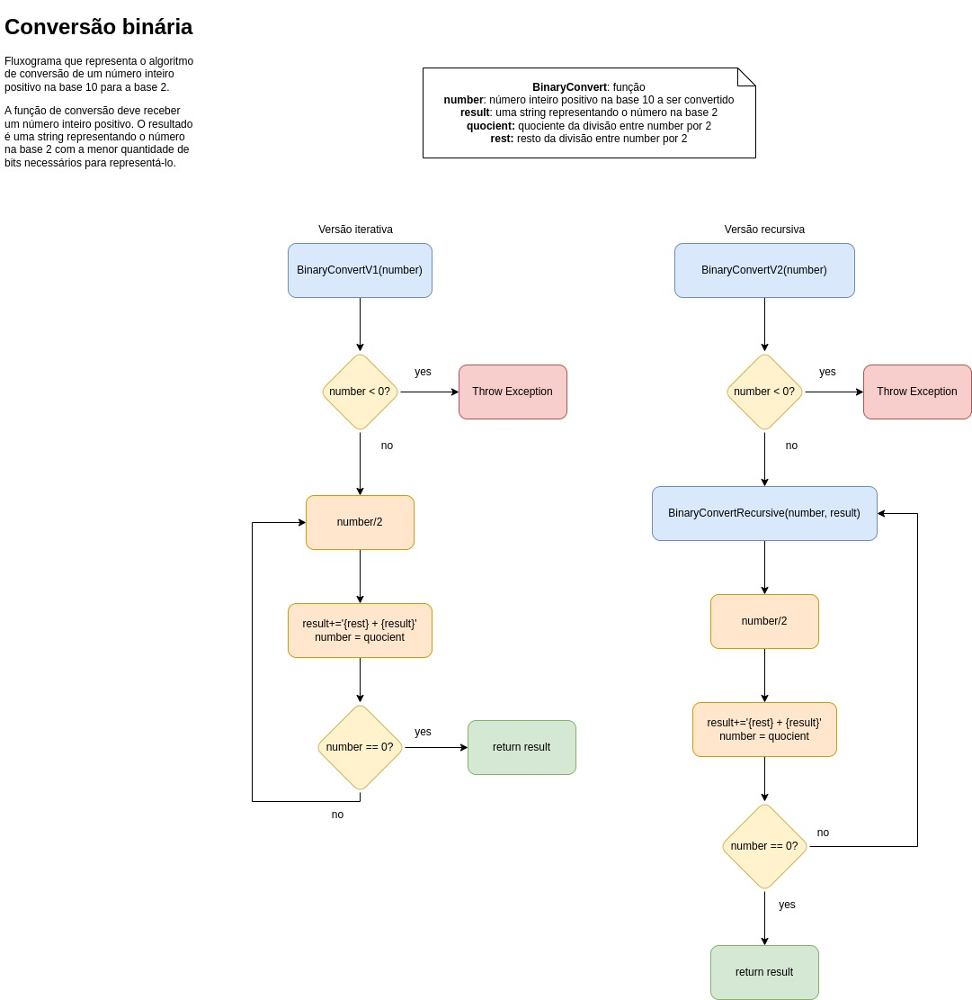

# computer-science

Repositório para estudos sobre algoritmos e fundamentos da ciência da computação, praticando conceitos e exemplos por meio da programação.

## Binary Numbers

Fluxograma que representa o algoritmo de conversão de um número inteiro positivo na base 10 para a base 2.
A função de conversão deve receber um número inteiro positivo. O resultado é uma string representando o número na base 2 com a menor quantidade de bits necessários para representá-lo.

